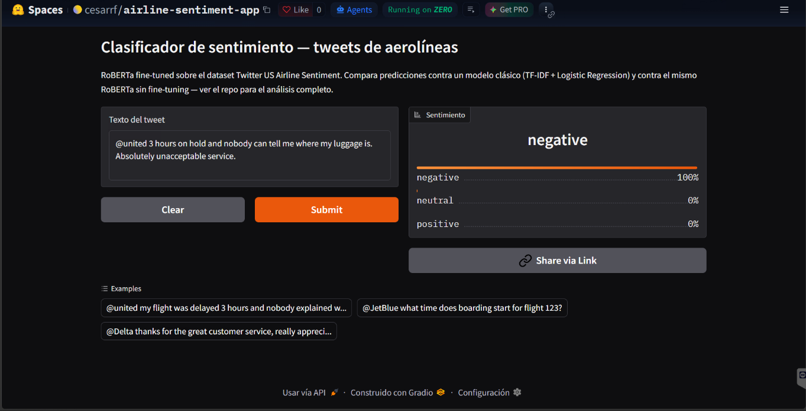
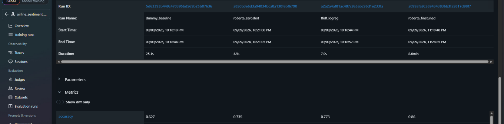
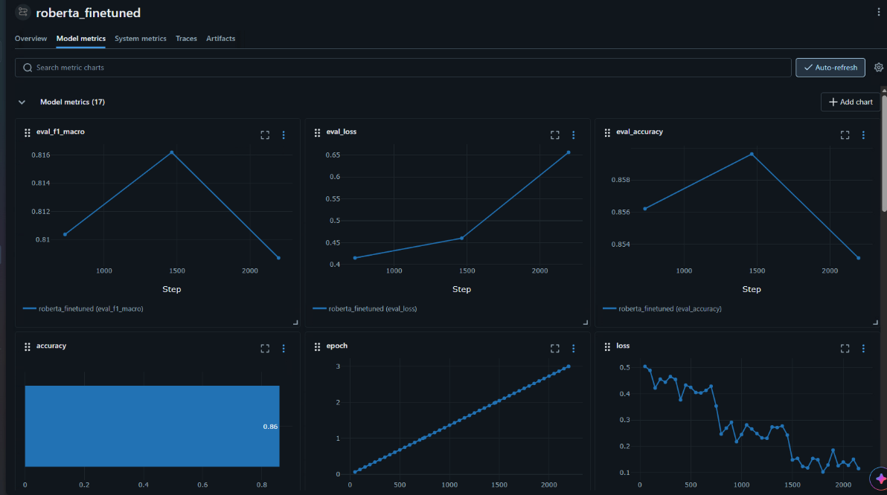
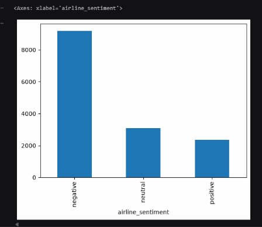
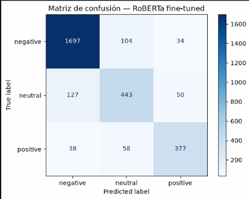
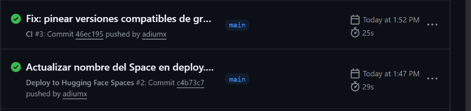

# Clasificador de Sentimiento en Tweets de Aerolíneas

[](https://github.com/adiumx/airline-sentiment-classifier/actions/workflows/ci.yml)
[](https://github.com/adiumx/airline-sentiment-classifier/actions/workflows/deploy.yml)

Pipeline end-to-end de clasificación de sentimiento en tweets dirigidos a aerolíneas: comparación de 4 enfoques, tracking de experimentos con MLflow, pruebas automatizadas, CI/CD con GitHub Actions y despliegue en Hugging Face Spaces.

**[→ Probar la demo en vivo](https://huggingface.co/spaces/cesarrf/airline-sentiment-app)**



---

## Resultados

| Modelo | Accuracy | F1 macro |
|---|---|---|
| Dummy (siempre predice la clase mayoritaria) | 0.627 | 0.257 |
| TF-IDF + Logistic Regression | 0.773 | 0.728 |
| RoBERTa pre-entrenado (zero-shot) | 0.735 | 0.708 |
| **RoBERTa fine-tuned** | **0.860** | **0.816** |



El hallazgo más interesante: **el modelo clásico (TF-IDF) superó al transformer pre-entrenado sin fine-tuning**. Un modelo simple entrenado específicamente en el dominio venció a uno mucho más potente pero genérico. Solo tras el fine-tuning el transformer tomó la delantera, mejorando en las tres clases a la vez.



La training loss baja de forma constante mientras la validación empeora a partir de la época 2 
— sobreajuste clásico. `load_best_model_at_end=True` descartó automáticamente la época 3 
y conservó el checkpoint de la época 2.

---

## Dificultades y decisiones de diseño

Esta sección documenta los problemas reales del proyecto, no la versión idealizada.

### 1. El primer dataset era sintético — y lo descubrí entrenando

Empecé con un dataset de tickets de soporte de Kaggle. Tras entrenar un clasificador de prioridad obtuve **26% de accuracy con 4 clases balanceadas** — exactamente el nivel del azar (25%).

Investigando el dataset encontré la explicación:
- El placeholder `{product_purchased}` aparecía sin reemplazar en las **8,469 filas**
- El 69% de los tickets empezaban con la misma frase literal
- La columna `Resolution` contenía texto sin sentido semántico ("Offer investment fish", "Window range building see answer job boy")
- `Customer Satisfaction Rating` tenía una distribución uniforme casi perfecta entre 1 y 5, estadísticamente improbable en datos reales

**Conclusión:** la prioridad había sido asignada al azar durante la generación, sin relación con el texto. Ningún modelo podía aprender algo que no estaba ahí.

**Qué hice:** migré a un dataset de tweets reales etiquetados por humanos (Twitter US Airline Sentiment, 14,640 tweets vía CrowdFlower), reutilizando el pipeline ya construido. El código de MLflow, la estructura del repo y los tests no cambiaron — solo la fuente de datos y el preprocesamiento.

**Por qué importa:** el 26% no fue un fracaso, fue el diagnóstico. Un modelo que rinde al nivel del azar sobre datos balanceados es evidencia de que el problema está en los datos, no en el modelo.

### 2. Dos pipelines de limpieza distintos, no uno

El instinto inicial fue escribir una sola función de limpieza. Fue un error.

TF-IDF se beneficia de texto normalizado: minúsculas, sin puntuación, sin menciones. Pero RoBERTa fue pre-entrenado con texto natural de Twitter — las mayúsculas, los signos de exclamación y las menciones normalizadas a `@user` **son señal para él, no ruido**. Aplicarle la limpieza agresiva le quita información que sabe aprovechar.

```python
def clean_for_tfidf(text):      # minúsculas, sin puntuación, sin menciones
def clean_for_transformer(text): # preserva caso y puntuación, normaliza @usuario → @user
```

### 3. Un bug de evaluación que invalidaba la comparación

Al evaluar RoBERTa le estaba pasando `text_clean_tfidf` en lugar de `text_clean_transformer`. El transformer estaba siendo juzgado con el input equivocado.

Corregirlo subió su desempeño de **0.710 → 0.735** en accuracy. La conclusión general no cambió (TF-IDF seguía ganando en zero-shot), pero la diferencia se redujo de 6.3 a 3.8 puntos — una comparación mucho más honesta.

**Causa raíz:** hacía dos llamadas separadas a `train_test_split`, una por cada columna de texto. Aunque con el mismo `random_state` caen en las mismas filas, es frágil: cualquier filtrado intermedio las desincroniza silenciosamente. Lo cambié a un solo split de índices:

```python
train_idx, test_idx = train_test_split(df_model.index, stratify=..., random_state=42)
train_df, test_df = df_model.loc[train_idx], df_model.loc[test_idx]
```

Así, por construcción, ambos modelos se evalúan sobre exactamente los mismos tweets.

### 4. Clases desbalanceadas: por qué accuracy no bastaba

El dataset real tiene 62.7% negative, 21.2% neutral, 16.1% positive — un desbalance que refleja cómo la gente realmente usa Twitter con aerolíneas.



Un modelo que siempre predijera "negative" obtendría 62.7% de accuracy sin aprender nada. Por eso:
- Métrica principal: **F1 macro** (pesa las 3 clases por igual). El dummy obtiene 0.257 ahí, dejando claro que no aprende.
- `class_weight="balanced"` en la regresión logística
- Split **estratificado**, para que train y test mantengan las mismas proporciones

### 5. La frontera neutral/negative es ambigua incluso para humanos

En los cuatro modelos, el error más frecuente fue confundir "neutral" con "negative". La matriz de confusión del mejor modelo muestra 127 neutrales clasificados como negativos, contra solo 50 clasificados como positivos.



Tiene sentido: un tweet neutral ("¿a qué hora abordo?") comparte vocabulario con uno negativo (vuelos, horarios, problemas) sin la carga emocional. La frontera entre "informativo" y "queja leve" es genuinamente difusa.

### 6. El modelo aprende asociaciones léxicas, no razonamiento

Probando la demo con un caso límite:

> "@united my flight was delayed 3 hours but I have access to drinks and food and I'm relaxed"

El modelo lo clasifica como **negative**, aunque el tono es claramente de conformidad. La palabra "delayed" co-ocurre casi siempre con sentimiento negativo en el training set, y esa señal domina sobre el contexto que la contradice.

No es un bug: es una limitación esperable. El modelo reconoce patrones estadísticos de co-ocurrencia, no evalúa lógicamente "hecho negativo + actitud positiva = neutral". Con ~11.7k ejemplos de fine-tuning, no hay suficientes casos así para que aprenda a contrarrestarlo.

### 7. Por qué descarté el LSTM bidireccional

Consideré agregar un LSTM como punto intermedio entre TF-IDF y el transformer. Lo descarté por dos razones concretas:
- **Dataset chico** (11.7k ejemplos de entrenamiento): los LSTM necesitan bastantes datos para aprender dependencias secuenciales sin sobreajustar
- **Texto corto** (tweets): las dependencias a larga distancia que un LSTM aprovecha importan mucho más en textos largos

No construirlo fue una decisión, no un olvido.

### 8. Problemas de infraestructura en el despliegue

Tres bloqueos reales al desplegar, que el CI **no detectó**:

**Conflicto de dependencias.** `gradio==4.44.1` importa internamente `HfFolder`, una función que versiones recientes de `huggingface_hub` ya eliminaron. Sin pines de versión, pip instaló la más nueva y la app crasheaba al arrancar. La solución no fue downgradear `huggingface_hub`, sino subir el `sdk_version` del Space a una versión de gradio que ya no depende de esa función.

**Doble fuente de verdad para la versión de gradio.** Hugging Face fuerza la versión desde el `sdk_version` del README del Space. Fijar también `gradio` en `requirements.txt` producía un conflicto irresoluble (`ERROR: ResolutionImpossible`). La solución: no fijar gradio en requirements y dejar que la plataforma lo maneje.

**Cambio de política del free tier.** Hugging Face eliminó "CPU Basic" del tier gratuito, dejando solo ZeroGPU. Ese runtime exige al menos una función decorada con `@spaces.GPU` o detiene el Space al arrancar — aunque este modelo no necesite GPU. Hubo que adaptar el código a un requisito de la plataforma, no del proyecto.

### 9. Lo que mi CI cubre, y lo que no

Los tres problemas anteriores llegaron a producción con el CI en verde. Eso no es contradictorio: las 13 pruebas validan `src/preprocess.py` (limpieza de texto y split), nada más.



**No cubre:** que `app.py` importe correctamente, que las dependencias del Space sean compatibles entre sí, ni la configuración del runtime.

Una mejora pendiente y concreta: `clean_for_transformer()` está duplicada en `app.py` y en `src/preprocess.py`. Si cambio una y olvido la otra, la app y el entrenamiento usarían preprocesamiento distinto — un bug silencioso que ningún test actual detectaría.

---

## Arquitectura

```
código → pytest (CI) → MLflow tracking → deploy automático → Space público
```

```
airline-sentiment-classifier/
├── src/
│   ├── preprocess.py          # limpieza dual + carga y split estratificado
│   ├── train_baseline.py      # Dummy + TF-IDF/LogReg, logueados en MLflow
│   └── train_transformer.py   # RoBERTa zero-shot + fine-tuning
├── tests/
│   └── test_preprocess.py     # 13 pruebas del preprocesamiento
├── app/                        # demo de Gradio desplegada en HF Spaces
├── notebooks/
│   └── exploracion.ipynb      # análisis exploratorio y prototipado
└── .github/workflows/          # CI (pytest) + CD (deploy a HF Spaces)
```

**Stack:** Python, scikit-learn, PyTorch, Transformers, MLflow, pytest, GitHub Actions, Gradio.

---

## Reproducir

```bash
python -m venv venv && venv/Scripts/activate   # Windows
pip install -r requirements.txt

python src/train_baseline.py        # Dummy + TF-IDF (segundos)
python src/train_transformer.py     # zero-shot + fine-tuning (~9 min con GPU)

mlflow ui --backend-store-uri sqlite:///mlflow.db   # ver resultados
pytest tests/ -v
```

El fine-tuning se hizo en una RTX 3060 (~9 minutos, 3 épocas). El modelo resultante está publicado en [cesarrf/roberta-airline-sentiment](https://huggingface.co/cesarrf/roberta-airline-sentiment).

---

## Alcance y limitaciones

- **El dataset son tweets públicos, no tickets internos.** La gente escribe distinto en un canal público que en un ticket privado: los tweets pueden sobre-representar quejas más dramáticas por su naturaleza performativa.
- **Los datos son de 2015.** El lenguaje y los temas de queja pueden haber cambiado; el modelo no fue evaluado sobre tweets recientes.

## Aplicaciones

Lo que este clasificador sí permite, con los datos disponibles:
- Priorizar la respuesta a tweets negativos en redes sociales, donde la visibilidad pública hace que el tiempo de reacción importe
- Monitorear la proporción de sentimiento a lo largo del tiempo como métrica de reputación
- Cruzado con la columna `negativereason` del dataset, identificar qué causas concretas (retrasos, servicio, equipaje) concentran más quejas